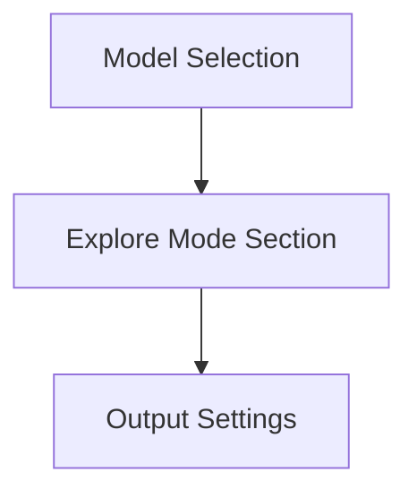
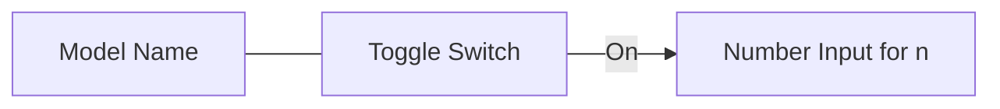
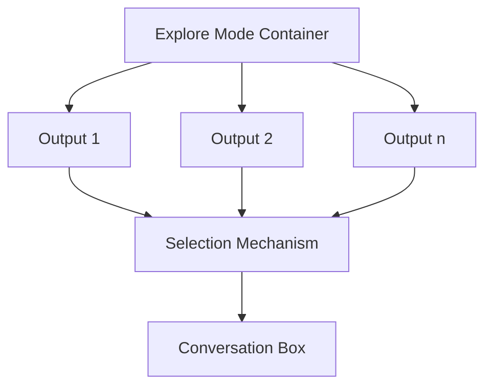
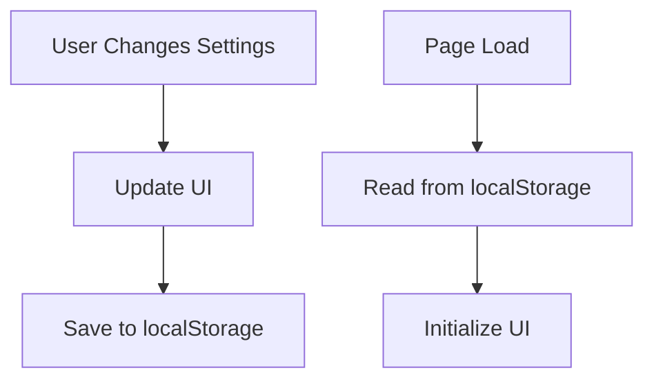
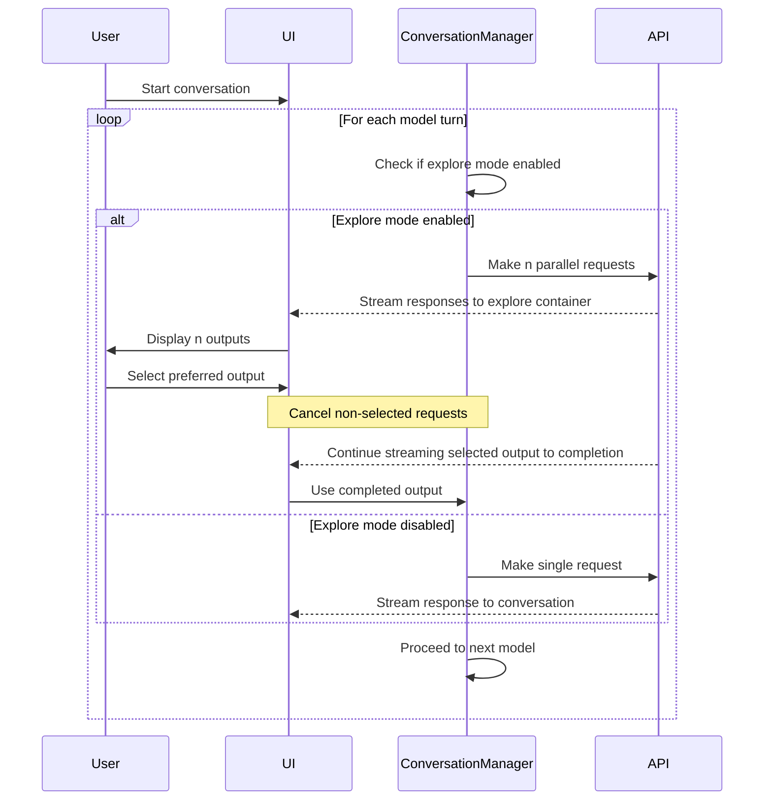

# Detailed Implementation Plan for "Explore Mode" Feature

Based on my analysis of the codebase and your requirements, I'll outline a comprehensive plan for implementing the "explore mode" feature. This feature will allow users to generate multiple parallel responses from each model and select their preferred output to continue the conversation.

## 1. UI Changes

### 1.1. Add Explore Mode Collapsible Section

We'll add a new collapsible section for "explore mode" between the model selection and output settings sections in the HTML structure:

### 1.2. Explore Mode Settings UI

For each model in the model selection, we'll add:
- A row with the model name
- A toggle switch for enabling/disabling explore mode
- A number input for "n" (number of simultaneous requests) that appears when the toggle is on
- Constraints: n should be between 1 and 8

### 1.3. Explore Mode Output UI

When explore mode is active for a model:
- Create a container above the conversation box to display multiple outputs
- Divide the container into sections for each of the n outputs
- Add selection functionality to each output section
- Highlight the selected output

## 2. Data Management

### 2.1. State Management

We'll need to track:
- Which models have explore mode enabled
- The value of n for each model
- The current state of parallel requests
- Which output has been selected

### 2.2. LocalStorage Persistence

We'll persist the explore mode settings in localStorage:
- Store settings by model position (e.g., "Model 1", "Model 2")
- Save toggle state and n value
- Ensure settings are not reset when changing model selection

## 3. Core Functionality Changes

### 3.1. Conversation Flow Modification

We need to modify the conversation flow to:
- Check if explore mode is enabled for the current model
- Make n simultaneous requests if enabled
- Display the parallel outputs in the explore mode container
- Wait for user selection before proceeding
- Continue streaming the selected output to completion
- Use the selected output for the conversation

**Important Note:** The selection container should only be visible if explore mode is enabled for at least one model. If no models have explore mode enabled, the selection container should be hidden.

### 3.2. Request Management

We need to:
- Create a mechanism to make multiple simultaneous requests
- Handle streaming for multiple outputs
- Manage cancellation of non-selected outputs
- Ensure proper error handling for parallel requests

## 4. Implementation Details

### 4.1. HTML/CSS Changes

- Add the explore mode collapsible section to index.html
- Create CSS styles for the explore mode container and outputs
- Ensure responsive design for mobile devices
- Add styles for showing/hiding the explore mode output container based on whether any model has explore mode enabled

### 4.2. JavaScript Changes

#### 4.2.1. UI Initialization and Event Handling

- Initialize explore mode UI based on localStorage
- Add event listeners for toggles and number inputs
- Handle collapsible section behavior

#### 4.2.2. Conversation Class Modifications

- Extend the Conversation class to support parallel requests
- Add methods for handling user selection
- Modify the processTurn method to support explore mode
- Implement logic to continue streaming the selected output while canceling other requests
- Add functionality to emit the selected output to the conversation once selected

#### 4.2.3. API Integration

- Modify API calls to support multiple simultaneous requests
- Handle streaming for multiple outputs
- Manage request cancellation

## 5. Testing Strategy

- Test explore mode UI with different numbers of models
- Verify localStorage persistence works correctly
- Test parallel request functionality with different APIs
- Verify selection mechanism works as expected
- Test error handling and edge cases

## 6. Implementation Order

1. Add HTML structure for explore mode section
2. Implement CSS styling for new elements
3. Add localStorage persistence for explore mode settings
4. Modify Conversation class to support parallel requests
5. Implement explore mode container and selection UI
6. Connect all components and test end-to-end functionality

## 7. File Changes Required

1. `index.html` - Add explore mode section
2. `styles.css` - Add styles for explore mode UI
3. `app.ts` - Add UI initialization and event handling
4. `conversation.ts` - Modify to support parallel requests
5. `types.ts` - Add new types for explore mode